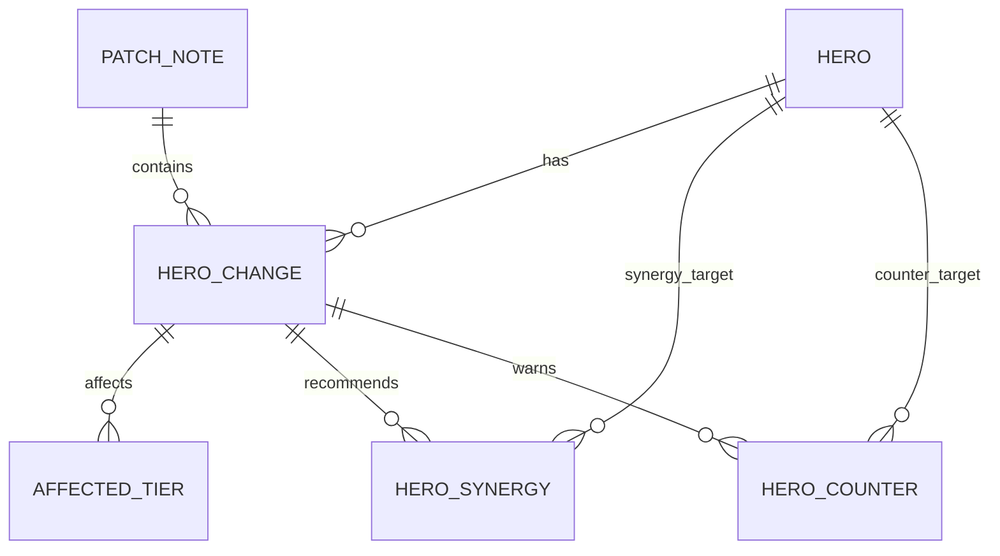

# Data Model

## JSON Analysis Shape

```ts
type PatchAnalysis = {
  patchId: string;
  patchTitle: string;
  patchDate: string;
  sourceUrl: string;
  overallSummary: string;
  metaSummary: string;
  changes: HeroChange[];
};

type HeroChange = {
  changeId: string;
  hero: HeroInfo;
  changeType: "BUFF" | "NERF" | "ADJUSTMENT" | "BUG_FIX";
  impactLevel: "LOW" | "MEDIUM" | "HIGH";
  originalChange: string;
  simpleSummary: string;
  metaImpact: string;
  affectedTiers: string[];
  recommendedPlaystyle: string;
  counterPicks: string[];
  synergyPicks: string[];
};

type HeroInfo = {
  heroId: string;
  nameKo: string;
  nameEn: string;
  role: "TANK" | "DAMAGE" | "SUPPORT";
  difficulty?: number;
  imageUrl?: string;
};
```

## Initial Tables

### heroes

Hero master table.

- id
- hero_id
- name_ko
- name_en
- role
- difficulty
- image_url
- created_at
- updated_at

### patch_notes

Analyzed patch note table.

- id
- patch_id
- title
- patch_date
- source_url
- raw_content
- overall_summary
- meta_summary
- created_at
- updated_at

### hero_changes

One row per hero-level change in a patch.

- id
- change_id
- patch_note_id
- hero_id
- change_type
- impact_level
- original_change
- simple_summary
- meta_impact
- recommended_playstyle
- created_at
- updated_at

### affected_tiers

Tier-specific impact data for each hero change.

- id
- hero_change_id
- tier
- reason

### hero_synergies

Recommended synergy heroes for a hero change.

- id
- hero_change_id
- target_hero_id
- reason

### hero_counters

Recommended counter heroes for a hero change.

- id
- hero_change_id
- target_hero_id
- reason

## Relationships



## Notes

- Keep `recommended_playstyle` as text for MVP.
- Move playstyles into a normalized table only after repeated categories emerge.
- Store `raw_content` for debugging LLM output.
- Validate LLM output with a runtime schema before inserting into the database.

