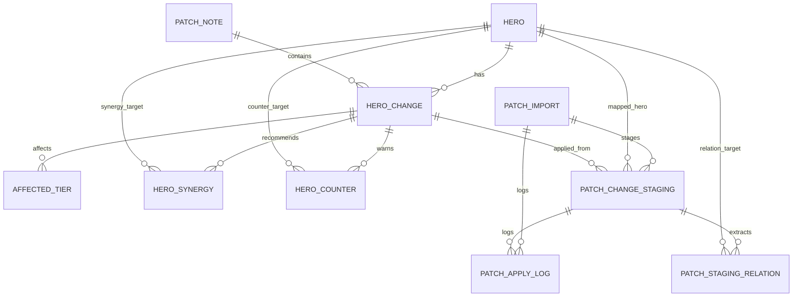

# Data Model

Last updated: 2026-08-07

Source of truth: `prisma/schema.prisma`. This document mirrors the current Prisma models and the patch import/review/apply workflow used by the app.

See `docs/ERD.md` for the full ERD and focused table-area diagrams.

## JSON Analysis Shape

The parser and apply workflow exchange a normalized patch analysis object before it is written to public analysis tables.

```ts
type PatchAnalysis = {
  patchId: string;
  patchTitle: string;
  patchDate: string;
  sourceUrl: string;
  overallSummary: string;
  metaSummary: string;
  changes: HeroChange[];
};

type HeroChange = {
  changeId: string;
  hero: HeroInfo;
  changeType: "BUFF" | "NERF" | "ADJUSTMENT" | "BUG_FIX";
  impactLevel: "LOW" | "MEDIUM" | "HIGH";
  originalChange: string;
  simpleSummary: string;
  metaImpact: string;
  affectedTiers: string[];
  recommendedPlaystyle: string;
  counterPicks: string[];
  synergyPicks: string[];
};

type HeroInfo = {
  heroId: string;
  nameKo: string;
  nameEn: string;
  role: "TANK" | "DAMAGE" | "SUPPORT";
  difficulty?: number;
  imageUrl?: string;
};
```

## Enums

| Enum | Values | Used by |
| --- | --- | --- |
| `HeroRole` | `TANK`, `DAMAGE`, `SUPPORT` | `heroes.role` |
| `ChangeType` | `BUFF`, `NERF`, `ADJUSTMENT`, `BUG_FIX` | `hero_changes.change_type`, `patch_change_staging.change_type` |
| `ImpactLevel` | `LOW`, `MEDIUM`, `HIGH` | `hero_changes.impact_level`, `patch_change_staging.impact_level` |
| `PatchImportStatus` | `IMPORTED`, `PARSED`, `REVIEWING`, `APPLIED`, `FAILED` | `patch_imports.status` |
| `PatchStagingStatus` | `PENDING`, `PENDING_REVIEW`, `NEEDS_MAPPING`, `APPROVED`, `REJECTED`, `APPLIED`, `FAILED` | `patch_change_staging.status` |
| `PatchApplyAction` | `IMPORT`, `PARSE`, `APPROVE`, `REJECT`, `APPLY`, `RETRY` | `patch_apply_logs.action` |
| `PatchApplyStatus` | `SUCCESS`, `FAILED` | `patch_apply_logs.status` |

## Public Analysis Tables

These tables drive the user-facing patch analysis and hero screens.

### heroes

Hero master data.

- `hero_id` is the stable public hero key and is unique.
- `name_ko`, `name_en`, `role`, `difficulty`, and `image_url` provide display and matching metadata.
- Indexed by `role`.

### patch_notes

Final analyzed patch note.

- `patch_id` is the stable public patch key and is unique.
- `patch_date` is stored as a date.
- `source_url`, `raw_content`, `overall_summary`, and `meta_summary` preserve source and generated context.
- Indexed by `patch_date`.

### hero_changes

One final hero-level change in a patch.

- `change_id` is unique.
- Belongs to one `patch_note` and one `hero`.
- Stores normalized change classification, original text, summary, meta impact, and recommended playstyle.
- Deleting a patch cascades to its changes. Deleting a hero is restricted while changes reference it.
- Indexed by `patch_note_id`, `hero_id`, `change_type`, and `impact_level`.

### affected_tiers

Tier impact labels for each final hero change.

- Unique by `hero_change_id` and `tier`.
- Deleted when the parent `hero_change` is deleted.

### hero_synergies

Recommended synergy heroes for a final hero change.

- Unique by `hero_change_id` and `target_hero_id`.
- Deleted when the parent `hero_change` is deleted.
- Deleting a referenced target hero is restricted.

### hero_counters

Recommended counter heroes for a final hero change.

- Unique by `hero_change_id` and `target_hero_id`.
- Deleted when the parent `hero_change` is deleted.
- Deleting a referenced target hero is restricted.

## Patch Update Workflow Tables

These tables support the admin Patch Feed: import URL, parse patch content, review staging rows, then apply approved rows into public analysis tables.

### patch_imports

One imported patch source.

- `source_url` and `content_hash` are unique to prevent duplicate imports.
- `raw_html` and `raw_text` preserve the fetched source.
- `status` tracks import, parser review, final apply, and failure states.
- `imported_at`, `parsed_at`, and `applied_at` mark workflow milestones.
- Related staging rows cascade on delete. Apply logs are preserved by setting their import reference to null.
- Indexed by `status`, `patch_date`, and `content_hash`.

### patch_change_staging

Parser output staged for admin review.

- Belongs to one `patch_import`.
- `hero_id` is nullable until the parsed hero is mapped to a known hero.
- `hero_name_raw` preserves the parser/source hero name even when mapping fails.
- `parsed_payload` stores the original parser result plus confidence breakdown and review decision details.
- `confidence` is a decimal score from `0` to `1`; current auto-apply candidate threshold is `0.85`.
- `status` distinguishes automatic candidates, rows needing review, rows needing hero mapping, approved/rejected rows, applied rows, and failed rows.
- `applied_hero_change_id` links the staging row to the final `hero_changes` row after apply.
- Indexed by `patch_import_id`, `hero_id`, `status`, and `change_type`.

### patch_staging_relations

Relations extracted for a staging row.

- `relation_type` currently uses `AFFECTED_TIER`, `SYNERGY`, and `COUNTER`.
- `value` preserves the raw tier or related hero name.
- `target_hero_id` is used for resolved `SYNERGY` and `COUNTER` hero links.
- Deleted when the parent staging row is deleted.
- Indexed by `staging_change_id`, `target_hero_id`, and `relation_type`.

### patch_apply_logs

Audit log for import, parse, review, apply, retry, and failure events.

- References to `patch_imports` and `patch_change_staging` are nullable and use `SetNull` on delete.
- `metadata` stores structured details such as source URL, parsed change count, staging count, or final patch ID.
- Indexed by `patch_import_id`, `staging_change_id`, `action`, and `status`.

## Relationships



## Workflow Summary

1. Import stores source HTML/text in `patch_imports` and writes an `IMPORT` log.
2. Parse converts source text into `PatchAnalysis`, then stores one row per change in `patch_change_staging`.
3. Staging confidence determines whether a row starts as `PENDING`, `PENDING_REVIEW`, or `NEEDS_MAPPING`.
4. Admin review can map heroes, remap related heroes, approve rows, reject rows, or return rows to review states.
5. Apply is allowed only while the import is `REVIEWING` and at least one complete staging row is `APPROVED`.
6. Apply writes final data through the patch analysis repository, marks applied staging rows as `APPLIED`, and marks the import as `APPLIED`.

## Notes

- Final user screens should read from public tables, not staging tables.
- Admin review screens should read from `patch_imports` and staging tables.
- `PatchImportStatus.PARSED` remains part of the enum for compatibility, but the current successful parser path writes `REVIEWING` after staging rows are saved.
- SQL DDL files under `docs/` are helper snapshots. Prisma schema remains the canonical model definition.
- Runtime schemas in `src/features/patch-analysis/schema.ts` and `src/features/patch-update/schema.ts` validate API-facing payloads before database writes.
