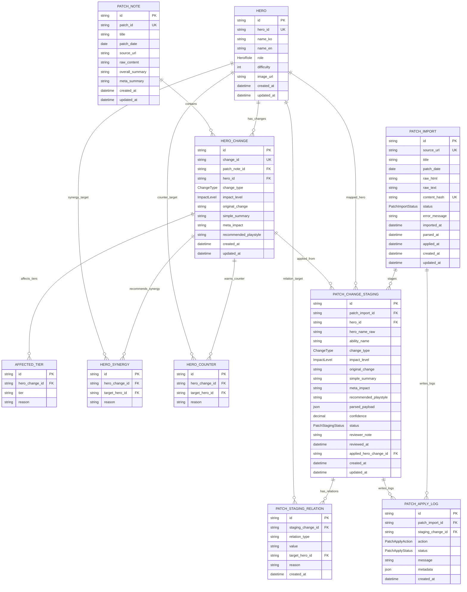
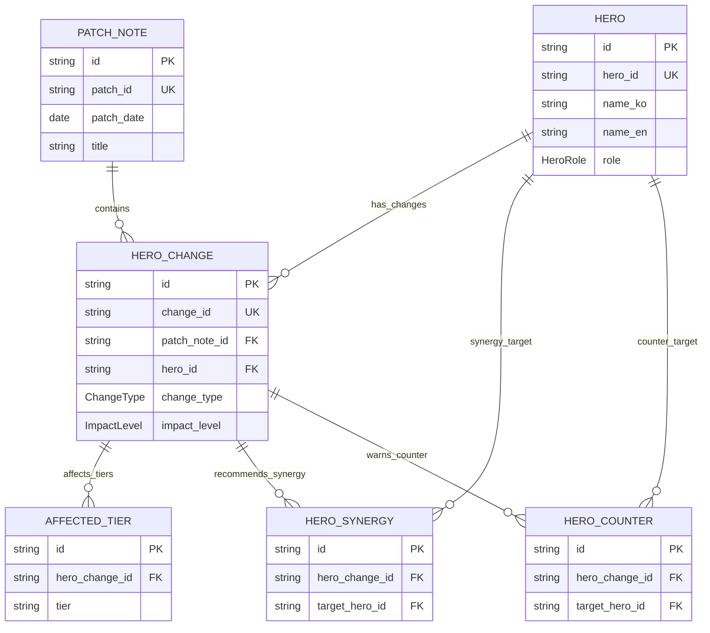
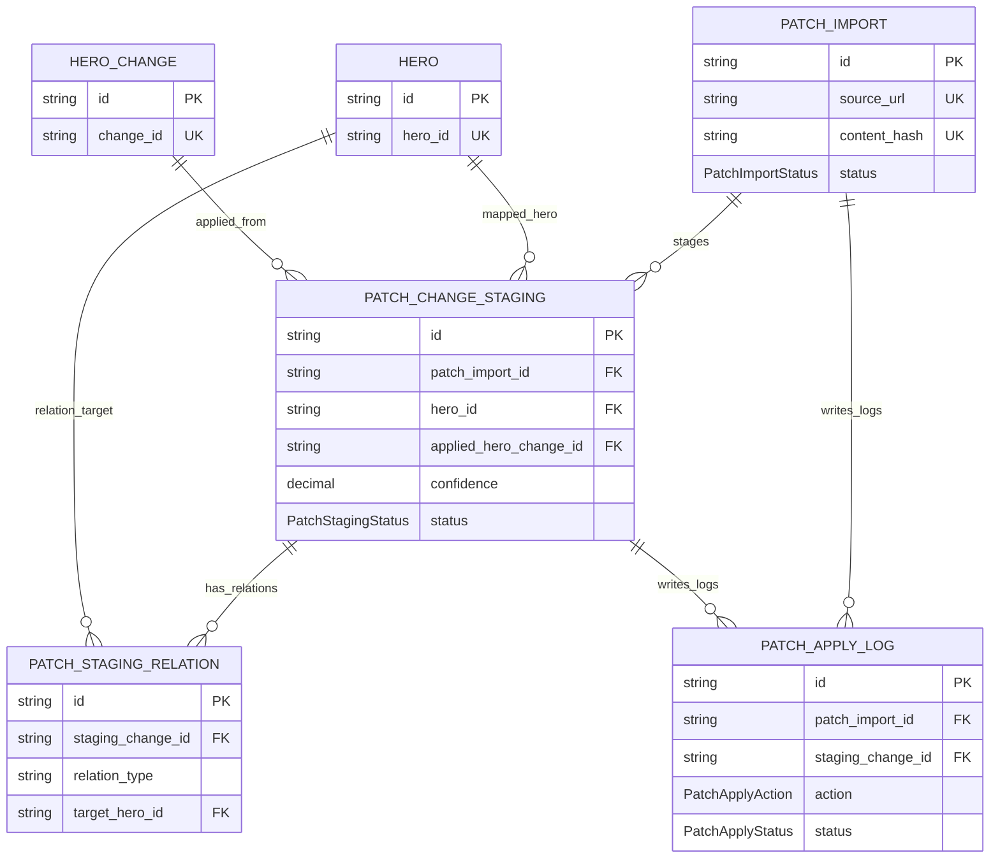

# ERD

Last updated: 2026-08-07

Source: `docs/DATA_MODEL.md` and `prisma/schema.prisma`.

## Full Data Model ERD

## Public Analysis Area

## Patch Update Workflow Area

## Relationship Notes

- `PATCH_NOTE` deletes cascade to `HERO_CHANGE`.
- `HERO_CHANGE` deletes cascade to `AFFECTED_TIER`, `HERO_SYNERGY`, and `HERO_COUNTER`.
- `PATCH_IMPORT` deletes cascade to `PATCH_CHANGE_STAGING`.
- `PATCH_CHANGE_STAGING` deletes cascade to `PATCH_STAGING_RELATION`.
- `PATCH_APPLY_LOG` preserves audit rows with nullable `patch_import_id` and `staging_change_id`.
- `HERO` deletion is restricted while public changes, synergies, counters, staging rows, or staging relations reference it.
- `PATCH_CHANGE_STAGING.applied_hero_change_id` is nullable until the approved staging row is applied.
